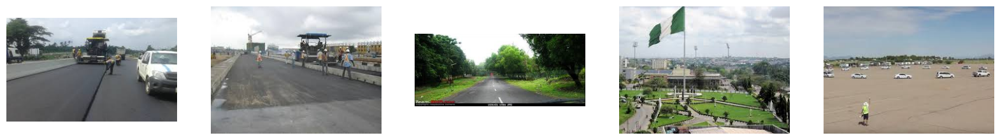
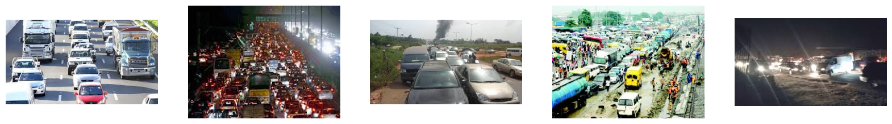
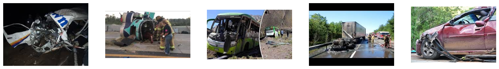
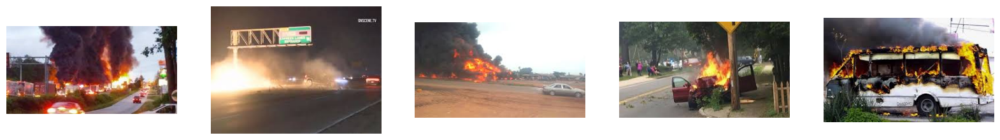

# Traffic Net Detection

This repository explored the classification of traffic conditions and incidents in traffic images using Convolutional Neural Networks (CNNs) built with both Keras Sequential and Functional APIst. This project demonstrates the value of both approaches. While the Sequential API achieved a strong accuracy of 80% in classifying traffic states.

## Project Overview
- Traffic Image Classification: Develop CNN models capable of accurately classifying various traffic conditions and incidents present in traffic images.
- Keras API Evaluation: Compare the performance of CNNs built using both the Sequential API and Functional API for traffic image classification.
- Model Accuracy Analysis: Evaluate the achieved accuracy of the models, specifically focusing on the ability to classify traffic states with high accuracy of 80%.

## Tools and Technologies
- Python
- Jupyter Notebook
- Pandas
- Matplotlib
- Seaborn
- Keras
- Tensorflow
- OpenCV
- Streamlit

## File Description
- `Traffic_Net_Detection.ipynb` : Jupyter Notebook containing the code used for data cleaning, exploratory data analysis, feature engineering, model training & evaluation and model improvement.
- `Traffic_Net_Detection_Inference.ipynb` : Jupyter Notebook containing the code for model inference testing.
- `model_seq.h5` : Best Model with Best Parameter

## Algorithm Used
- Sequential API
- Functional API

## Dataset Class Characteristics
---

The Sparse Traffic class category is characterized by:
- Slow streets
- Not many vehicles are captured in the image
- No congestion
---

The Dense Traffic class category is characterized by:
- Congestion on the road
- Congestion is detected by the number of vehicles captured in the image
---

The accident class category is characterized by:
- An overturned vehicle
- Crashed vehicle
- Vehicles that collided
If we look at the image above, most of the vehicles labeled as accident are collided, so the image usually consists of 2 vehicles.
---

The Fire class category is characterized by:
- the presence of fire in the image
- there is black smoke caused by the fire
- there is a striking red color depicted by the fire

## Conclussion
Based on the ANN Computer Vision model that has been created:

Of the two models that have been created, the sequential model has the best results with improvements made by reducing the number of neurons to 128 from the number of neurons 512. Sequential model successfully improved its test set accuracy to 80% from 76% accuracy.

**Excellence:**
- The model best predicts fire and sparse traffic categories.
- The accuracy of the model is above 70% so the model can well predict the classes in the dataset.

**Weaknesses:**
- The model is not good at predicting the accident category because there is less data in the accident class than other classes.

**Improvement:**
- Improve the model by trying various combinations of hidden layer, number of neurons, and learning rate that have not been tried on this notebook.

**Based on EDA:**
- The dataset used has a balanced data distribution with a percentage of 25% and a total of 900 images/data per class.
- The dataset used cannot be characterized by the mean image value.

**Business Insight:**

This Traffic Detection model using computer vision can be utilized for:

`Accident Detection System:` 

The model can be used to develop an accident detection system that can help emergency services respond to accidents more quickly.

`Traffict Prediction System:` 

The model can be used to develop a Traffict prediction system that can provide real-time information to drivers about traffic conditions.

Route Recommendation System:`

The model can be used to develop a route recommendation system that can help drivers find the best route to reach their destination.

`Transportation Planning System:` 

Models can be used to help governments and transportation organizations plan and develop more efficient and environmentally friendly transportation infrastructure and systems.

## Acknowledgements
Traffic-Net data used in this project was obtained from [Kaggle](https://www.kaggle.com/datasets/umairshahpirzada/traffic-net/data)

Model Deployment for this project on [Hugging Face](https://huggingface.co/spaces/ghtyas/TrafficnetCNN)
